## Projects

<table>
<tr><td width="50%" valign="top">

### Ridr

Carpool matching for families at my school. Parents get paired with others
nearby, the app tracks whose turn it is to drive, and everyone can follow the
trip live instead of guessing whether the car is five minutes out. It came out
of my own family's group chat turning into a mess every week.

[basisrides.vercel.app](https://basisrides.vercel.app) · [source](https://github.com/realvidhaan/ridr)

</td><td width="50%" valign="top">

### Velo

Hold-a-hotkey voice dictation for macOS, open source, in the same spirit as
Wispr Flow. Speech-to-text runs on device, then a small model strips filler
words and fixes punctuation before the text lands wherever your cursor is.
Point the cleanup step at Ollama and nothing ever leaves your machine.

[source](https://github.com/realvidhaan/velo)

</td></tr>
</table>

## Stack

## LeetCode and GitHub stats

<picture>
  <source media="(prefers-color-scheme: dark)" srcset="https://raw.githubusercontent.com/realvidhaan/realvidhaan/output/github-snake-dark.svg" />
  <source media="(prefers-color-scheme: light)" srcset="https://raw.githubusercontent.com/realvidhaan/realvidhaan/output/github-snake.svg" />
  
</picture>

## Elsewhere

