<div align="center">
  
</div>

<br/>

```bash
guest@vidhaan:~$ cat about.txt

[current]    building Velo — an open-source, push-to-talk voice dictation app, in the
             same spirit as WisprFlow
[seeking]    collaborators to get BasisRide into more carpool groups at my school
[learning]   how AI actually works under the hood, and how to wire it into my own apps
[compete]    ACSL — scored 39/40 at Nationals, went 3/3 in this year's Summer League
[fact]       earned my PADI Scuba Diving License at age 10

guest@vidhaan:~$ _
```

## Connect

<div align="center">

[](https://vidhaan.info)
[](mailto:realvidhaan@gmail.com)

</div>

## Stack

<div align="center">

                                 

</div>

## GitHub

<div align="center">


</div>

<div align="center">

<picture>
  <source media="(prefers-color-scheme: dark)" srcset="https://raw.githubusercontent.com/realvidhaan/realvidhaan/output/github-snake-dark.svg" />
  <source media="(prefers-color-scheme: light)" srcset="https://raw.githubusercontent.com/realvidhaan/realvidhaan/output/github-snake.svg" />
  
</picture>

</div>

---

<div align="center">


</div>

```bash
guest@vidhaan:~$ exit
```
